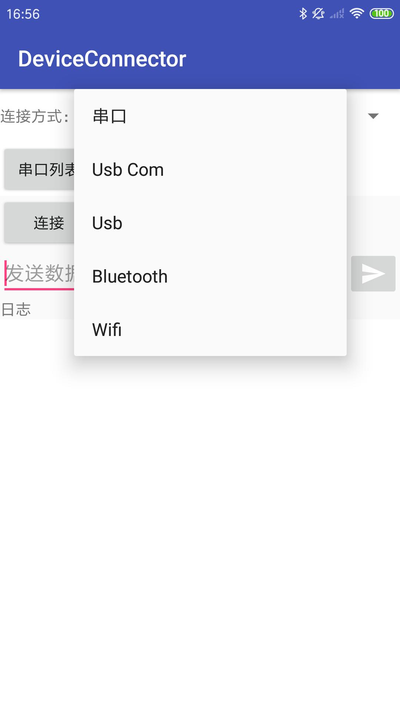
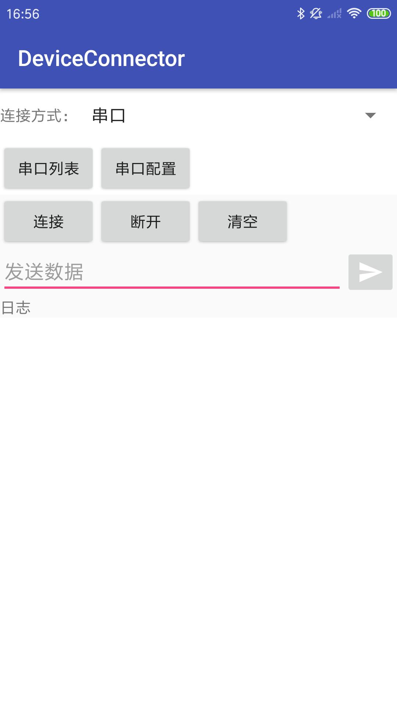
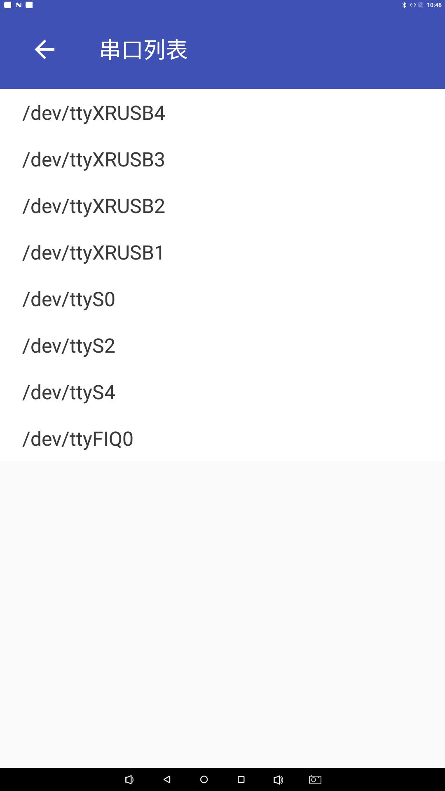
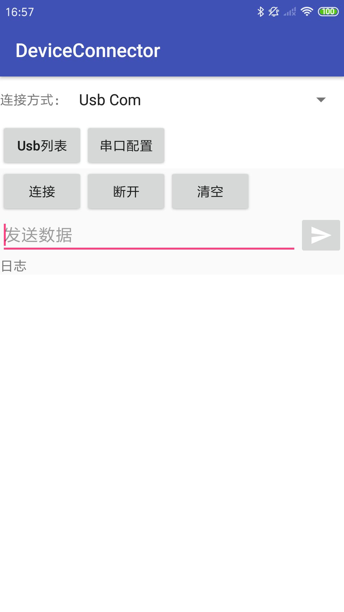
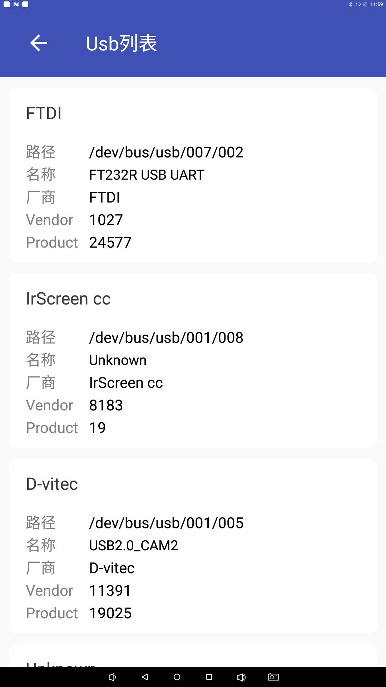
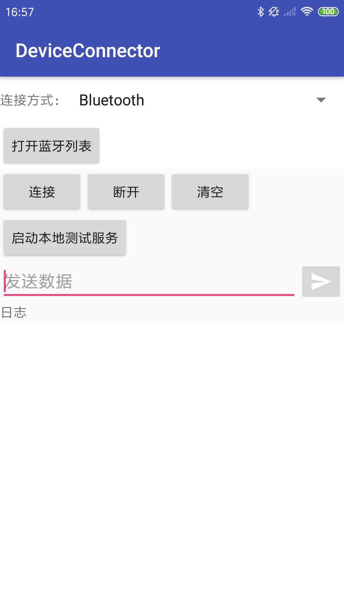
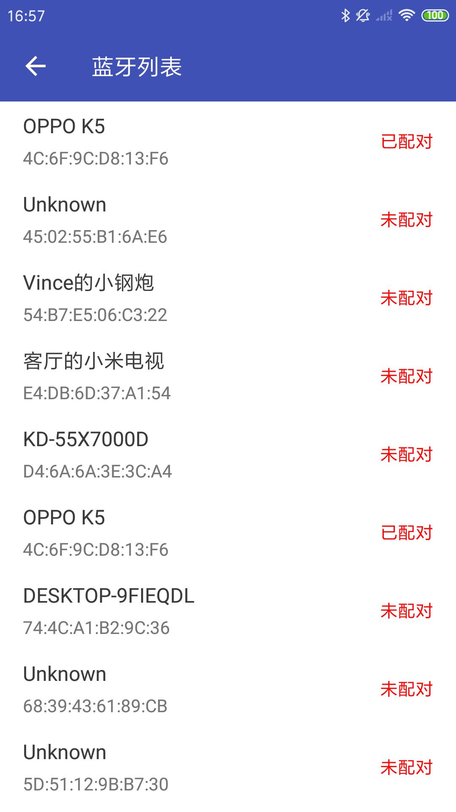
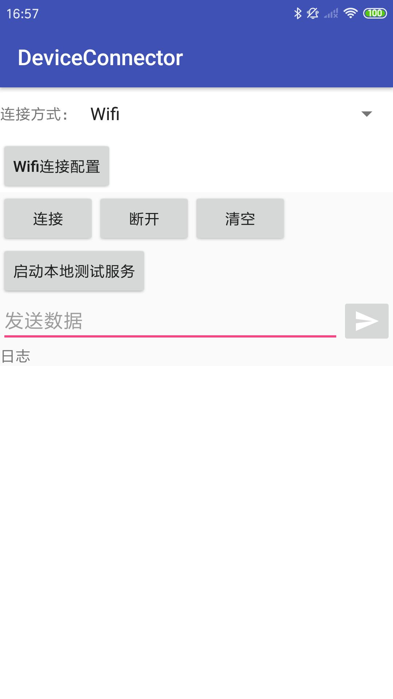

# DeviceConnector

Android 设备连接者，提供Android上位机和外设的连接通讯通道，支持多种连接方式选择，如串口、Usb Com、Usb、蓝牙、Wifi的连接，
DeviceConnector框架上层调用一致，底层不同实现，方便使用者切换连接方式。为简化上层调用和方便数据处理， 全部连接采用同步操作，即一发一收（一问一答）的方式通讯

**应用场景：**

基于硬件协议编写应用层硬件通讯（供应商没有提供SDK的情况），App示例可作为调试工具使用

# 效果图

[安装包下载](app-debug.apk)

  
  
  

# 依赖引入

步骤 1. 在工程跟目录build.gradle文件下添加仓库

	allprojects {
		repositories {
			...
			maven { url 'https://jitpack.io' }
		}
	}

步骤2. 添加依赖

	dependencies {
	      implementation 'com.github.kellysong:DeviceConnector:1.0.0'

	}

# API调用

**1.初始化实例**

    //串口
    BaseConnectProvider baseConnectProvider = new SerialPortConnectProvider(SerialPortConfig serialPortConfig);
    
    //Usb Com
    BaseConnectProvider baseConnectProvider = new UsbComConnectProvider(int vendorId, int productId, SerialPortConfig serialPortConfig);
    //or
    BaseConnectProvider baseConnectProvider = new UsbComConnectProvider(UsbDevice usbDevice, SerialPortConfig serialPortConfig);
    
    //Usb
    BaseConnectProvider baseConnectProvider = new UsbConnectProvider(int vendorId, int productId);
    //or
    BaseConnectProvider baseConnectProvider = new UsbConnectProvider(UsbDevice usbDevice);
    //蓝牙
    BaseConnectProvider baseConnectProvider = new BluetoothConnectProvider(BluetoothDevice bluetoothDevice);
    BaseConnectProvider baseConnectProvider = new BluetoothConnectProvider(String address);
    
    //Wifi
    BaseConnectProvider baseConnectProvider = new WifiConnectProvider(String host, int port, int connectTimeout, int readTimeout);

**2.打开连接**

    baseConnectProvider.open();

**3.写和读数据**

    baseConnectProvider.read(byte[] sendParams, byte[] buffer, int timeout);

**4.关闭连接**

    baseConnectProvider.close();

# 注意事项

1. 检查设备支持的连接方式
2. 检查连接参数配置是否正确
3. 发送数据时，检查数据是否符合硬件协议要求，此外注意是否需要在报文数据尾部追加报文结束符/r(0x0A)或/n(0x0D)或/r/n(0x0A 0x0D)或其它校验码
4. 传统串口连接需要Root,免Root连接建议使用Usb Com
5. Usb Com和Usb连接之前需要先申请Usb权限，再调用open，不然出现首次连接失败;需要注意的是，正常申请一次权限就可以，但是Usb设备被拔出或者应用卸载了，连接之前需要再次申请权限
6. Usb连接传输模式、传输速度的不同，要注意发送数据包的大小，这里的包指一次传输数据的大小，包大小受限于端点的最大包大小
7. Usb Com和Usb连接如果的read()方法的逻辑需要改变或者需要一次发送，多次循环读取（数据延迟返回）才能把数据读取完整的话，建议继承**连接提供者**，覆写read()方法
8. 蓝牙连接暂时支持经典蓝牙连接，不支持低功耗蓝牙(Ble);蓝牙搜索在Android 6.0以上需要申请定位权限；高版本蓝牙连接会弹出蓝牙配对授权窗口,建议在蓝牙设置里面进行配对和取消配对，配对一次即可；暂时不支持Android 12以上蓝牙打开和扫描，如需要自行放开AndroidManifest.xml权限和适配，然后再使用BaseConnectProvider
9. Wifi连接需要网络权限
10. App示例中，使用手机就可以模拟测试Wifi连接和蓝牙连接，前提是先启动服务；串口和USB测试需要相应的设备连接

# License

    Copyright 2022 Song Jiali
    
    Licensed under the Apache License, Version 2.0 (the "License");
    you may not use this file except in compliance with the License.
    You may obtain a copy of the License at
    
        http://www.apache.org/licenses/LICENSE-2.0
    
    Unless required by applicable law or agreed to in writing, software
    distributed under the License is distributed on an "AS IS" BASIS,
    WITHOUT WARRANTIES OR CONDITIONS OF ANY KIND, either express or implied.
    See the License for the specific language governing permissions and
    limitations under the License.